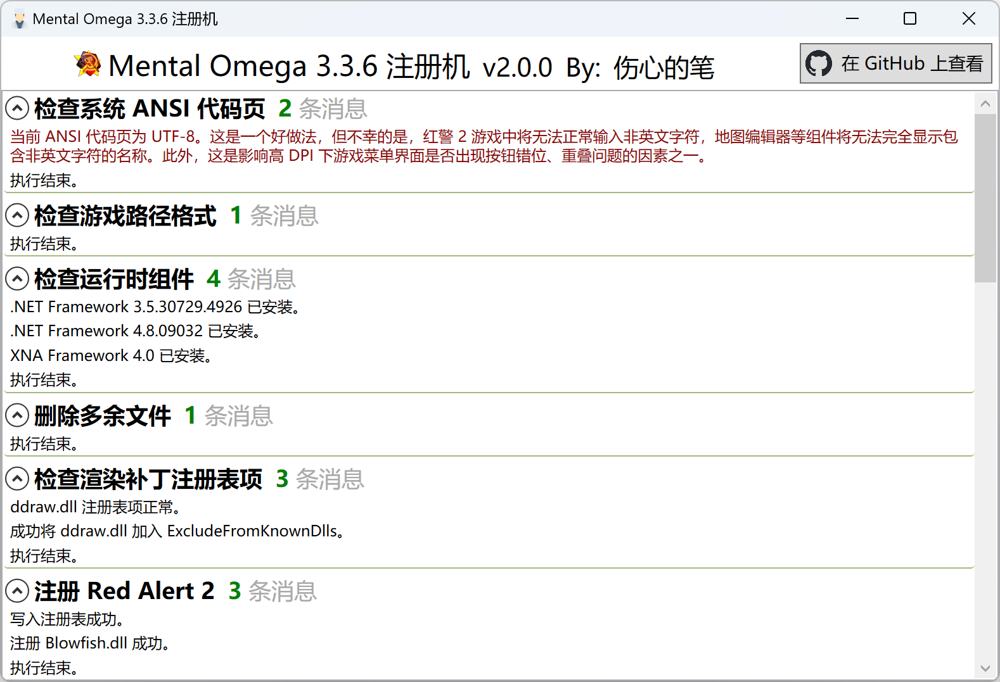

# MO 注册机

包含在心灵终结整合包内的游戏环境自动配置、诊断工具。稍作改动即可适用于其他同样基于 [xna-cncnet-client](https://github.com/CnCNet/xna-cncnet-client/) 的红警 2 / Ares / Phobos 游戏 Mod。

## 许可协议

本项目以 GPL v3.0 协议开源。简言之：不得移除作者信息、衍生版必须使用相同协议开源、作者无责。上述语句只为方便理解之用，以[协议全文](./LICENSE)为准。

## Localization

Implementing multi-language support is encouraged. Feel free to make a pull request.
