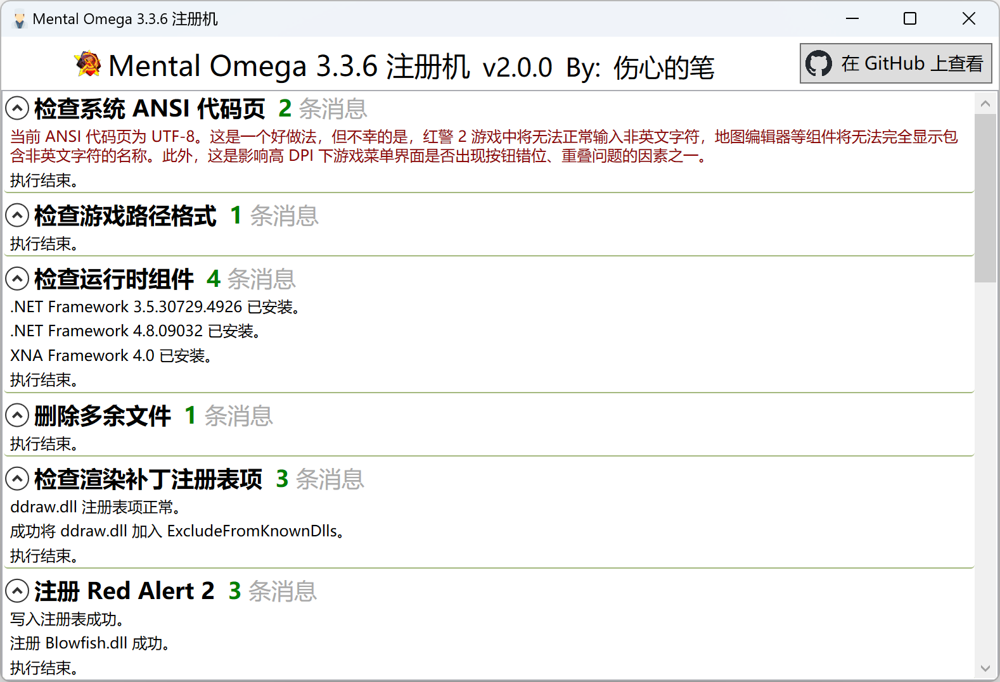

# MO3RegUI | MO 注册机

An automated game environment configuration and diagnostic tool included in the Chinese Mental Omega Integration Pack[^1]. With minor modifications, it can be adapted to other Red Alert 2 / Ares / Phobos game mods that are also based on the [xna-cncnet-client](https://github.com/CnCNet/xna-cncnet-client/).

包含在心灵终结中文整合包内的游戏环境自动配置、诊断工具。稍作改动即可适用于其他同样基于 [xna-cncnet-client](https://github.com/CnCNet/xna-cncnet-client/) 的红警 2 / Ares / Phobos 游戏 Mod。

## License | 许可协议

This project is open-sourced under the GPL v3.0 license. In short: copyright and license notices must be preserved, derivative works must be open-sourced under the same license, and the author/contributors provide no warranty. The statements above are for easy understanding only; please refer to the [full license text](./LICENSE) for the official legal terms.

本项目以 GPL v3.0 协议开源。简言之：不得移除作者信息、衍生版必须使用相同协议开源、作者无责。上述语句只为方便理解之用，以[协议全文](./LICENSE)为准。

[^1]: The Chinese Mental Omega Integration Pack is not an official MO project. 心灵终结中文整合包不是心灵终结官方项目。