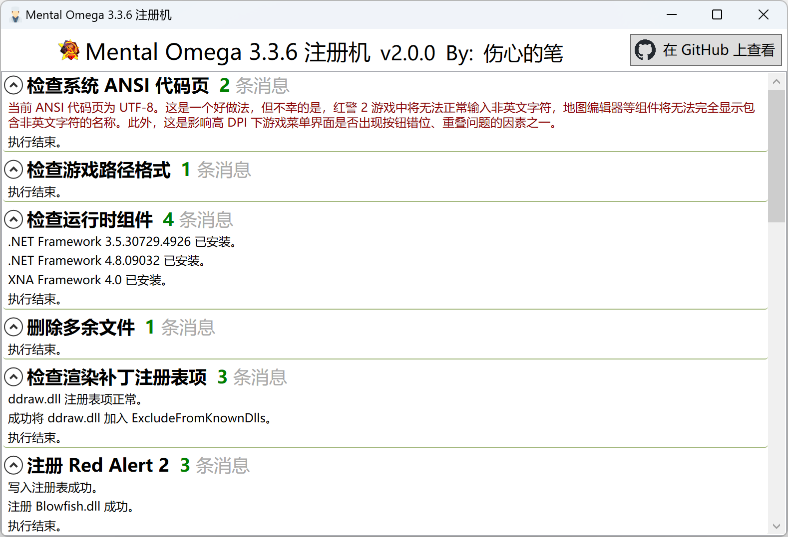

# MO3RegUI | MO 注册机

An automated game environment configuration and diagnostic tool included in the Chinese Mental Omega Integration Pack[^1]. With minor modifications, it can be adapted to other Red Alert 2 / Ares / Phobos game mods that are also based on the [xna-cncnet-client](https://github.com/CnCNet/xna-cncnet-client/).

包含在心灵终结中文整合包内的游戏环境自动配置、诊断工具。稍作改动即可适用于其他同样基于 [xna-cncnet-client](https://github.com/CnCNet/xna-cncnet-client/) 的红警 2 / Ares / Phobos 游戏 Mod。

## Architecture | 架构

The project is still a single assembly, but the code is split into four layers by folder and namespace, following the MVVM layout of the `xna-cncnet-client-mvvm` refactor. The important rule is that the View and the ViewModel never see each other; `MVVMContract` is the only surface they share.

- **`MVVMContract`** — the shared surface: the `IMainWindowViewModel` / `IMessageItem` contracts, the MVVM primitives (`ObservableObject`, `RelayCommand`), the shared constants and `MessageLevel`, and the `ViewServices` interfaces (`IDialogService`, `IUrlService`, `IViewLifecycleService`).
- **`ViewModel`** — all of the logic: `MainWindowViewModel` (which tasks run, the collected messages, the log export, the close confirmation), the message list, localization, and the `Tasks` plus their helpers.
- **`View`** — a dumb rendering layer: the XAML window, a code-behind that only assigns the DataContext, the value converters, and the View-side implementations of the `ViewServices` interfaces. It never references the `ViewModel` namespace.
- **`Exe`** — the composition root: it creates the View and the ViewModel, injects the View services into the ViewModel, connects the window lifecycle and starts the run. It is the only layer that knows both sides.

The View talks to the ViewModel only through `MVVMContract` (bindings and commands), and the ViewModel talks back to the View only through the `ViewServices` interfaces. No NuGet packages are introduced: Mo3RegUI must stay a single-file .NET Framework 4.0 WPF executable.

本项目仍然是单个程序集，但按文件夹和 namespace 拆成四层，结构参考 `xna-cncnet-client-mvvm` 的 MVVM 重构。核心约束是 View 与 ViewModel 互不可见，二者唯一共享的公共接口是 `MVVMContract`：View 只通过契约中的绑定和命令与 ViewModel 交互，ViewModel 只通过 `ViewServices` 接口回调 View，`Exe` 负责最初的创建与连接。不引入任何 NuGet 包，以保持 .NET Framework 4.0 单文件 WPF 程序。

## License | 许可协议

This project is open-sourced under the GPL v3.0 license. In short: copyright and license notices must be preserved, derivative works must be open-sourced under the same license, and the author/contributors provide no warranty. The statements above are for easy understanding only; please refer to the [full license text](./LICENSE) for the official legal terms.

本项目以 GPL v3.0 协议开源。简言之：不得移除作者信息、衍生版必须使用相同协议开源、作者无责。上述语句只为方便理解之用，以[协议全文](./LICENSE)为准。

[^1]: The Chinese Mental Omega Integration Pack is not an official MO project. 心灵终结中文整合包不是心灵终结官方项目。